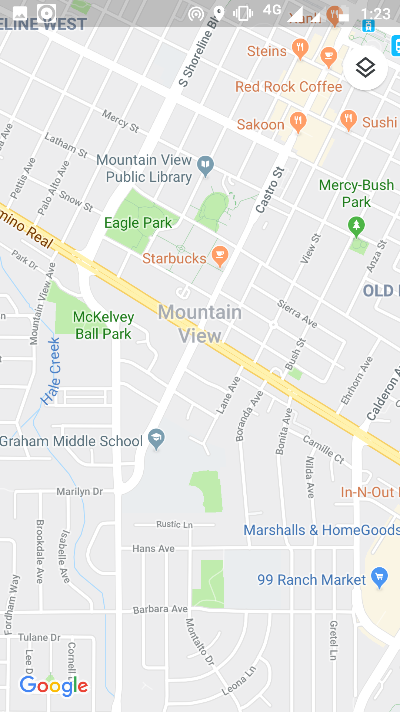
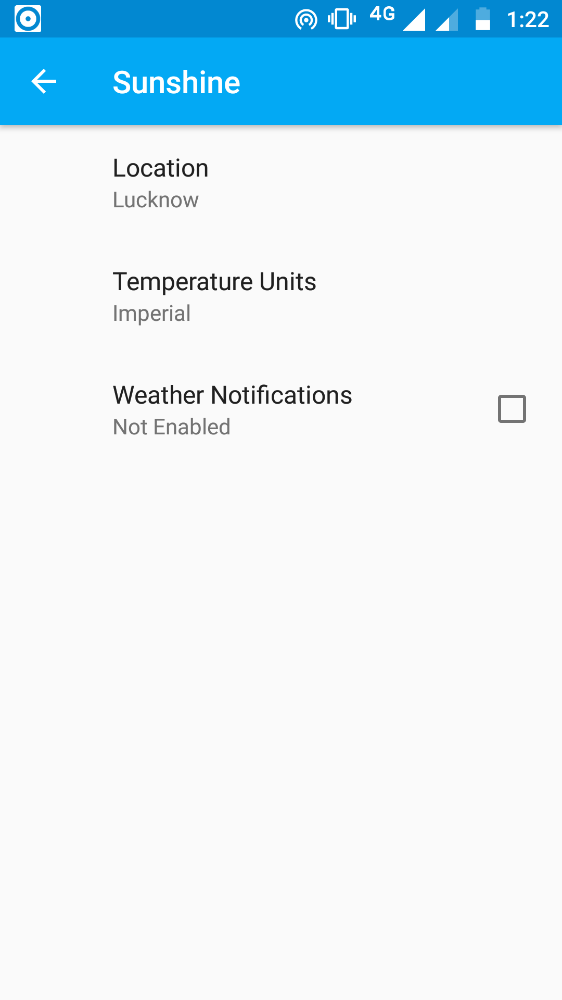

# SUNSHINE

## Project Detail
* It is an android application project
* It tells and predicts the weather details of your location
* You can set the location according to your choise

## User Interface

</img>
</img>
</img>

## Problems Faced
* [How to use external libraries in android studio](https://stackoverflow.com/questions/25610727/adding-external-library-in-android-studio)
* [Networking in android ](https://developer.android.com/training/basics/network-ops)
* [SharedPrefernces in android  ](https://developer.android.com/training/basics/network-ops)
* [Fixing Gradle ](https://stackoverflow.com/questions/29808199/error-running-android-gradle-project-sync-failed-please-fix-your-project-and-t)

## External Libraries used
### [OkHttp ](https://developer.android.com/training/basics/network-ops)
HTTP is the way modern applications network. It’s how we exchange data & media. Doing HTTP efficiently makes your stuff load faster and saves bandwidth.
#### OkHttp is an HTTP client that’s efficient by default:
* HTTP/2 support allows all requests to the same host to share a socket.
* Connection pooling reduces request latency (if HTTP/2 isn’t available).
* Transparent GZIP shrinks download sizes.
* Response caching avoids the network completely for repeat requests.

